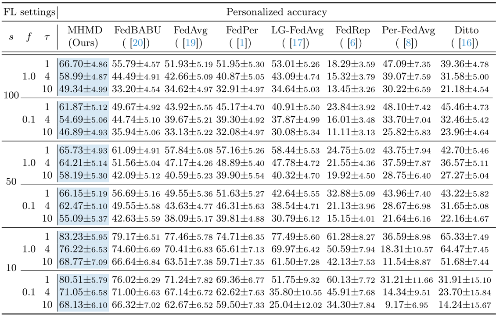

# Enhancing Federated Representation via Multi-Head Mutual-Distillation


## Introduction

Federated Learning is a framework that aims to improve a single global model across devices by addressing the challenges posed by data heterogeneity. In this work, we present the Multi-Head Mutual-Distillation (MHMD) model, which applies the multi-head-based self-knowledge distillation mechanism to enhance the representation power of a federated learned global model. This implementation uses lightweight auxiliary classification heads to deploy the self-knowledge distillation mechanism on a global model. With the help of the FedBABU learning algorithm, we show that the resulting global model can achieve high classification accuracy and can personalize the client data quickly and accurately. We also provide the mutual distillation loss and temperature scaler. The former enables the auxiliary classifier of correct prediction to give feedback on its knowledge to the deepest classifier, while the latter learns the data-dependent temperature value for each training sample. Both mechanisms increase prediction accuracy for classifiers. 


## Implementation
### 1. Prerequisites
* Ubuntu 20.04.6
* Python 3.9
* Pytorch 1.7.1
* CUDA 10.1
* torchvision 0.8.2
* numpy 1.21.5
* sklearn 0.20.0
* matplotlib 3.1.2
* Pillow 9.0.1


### 2. Data Preparation
* Please download the CIFAR10 and CIFAR100 [data](https://www.cs.toronto.edu/~kriz/cifar.html).


### 3. Quick Start
```bash
  $ git clone https://github.com/CAIVIAC/FL_SD.git
  $ conda create --name fl_sd python=3.9 -y
  $ conda activate fl_sd
  $ pip install torch==1.7.1+cu101 torchvision==0.8.2+cu101 torchaudio==0.7.2 -f https://download.pytorch.org/whl/torch_stable.html
  $ bash ./scripts/run_fedours.sh
``` 


### 4. Results
* Personalization Performance Comparison


* Fine-tuning Speed for Personalization


# Acknowledgements
This codebase was adapted from [FedBABU](https://github.com/jhoon-oh/FedBABU.git).
